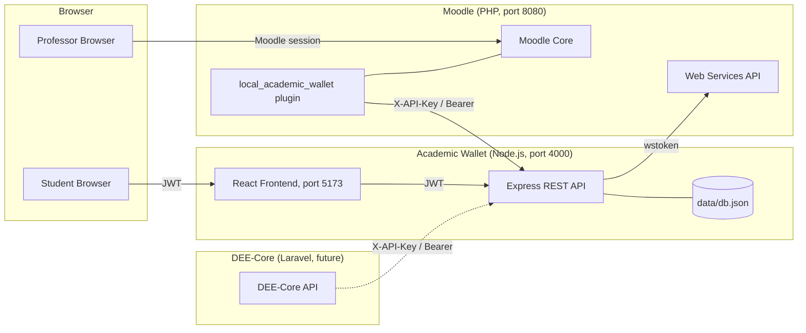
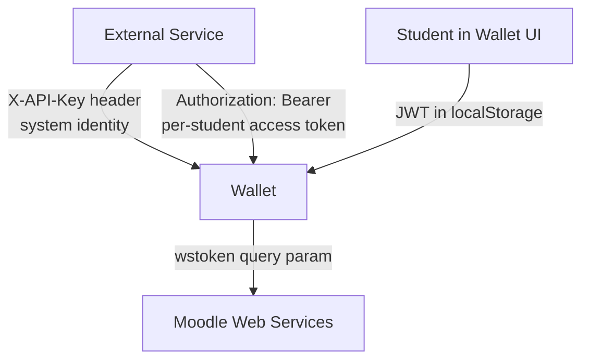
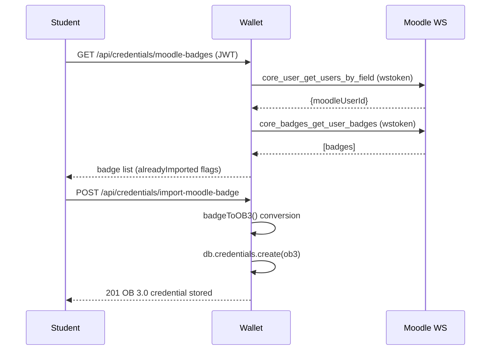
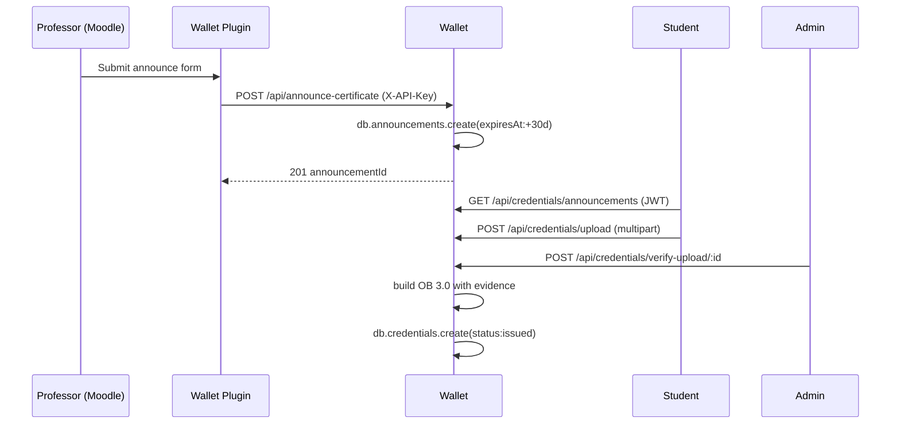
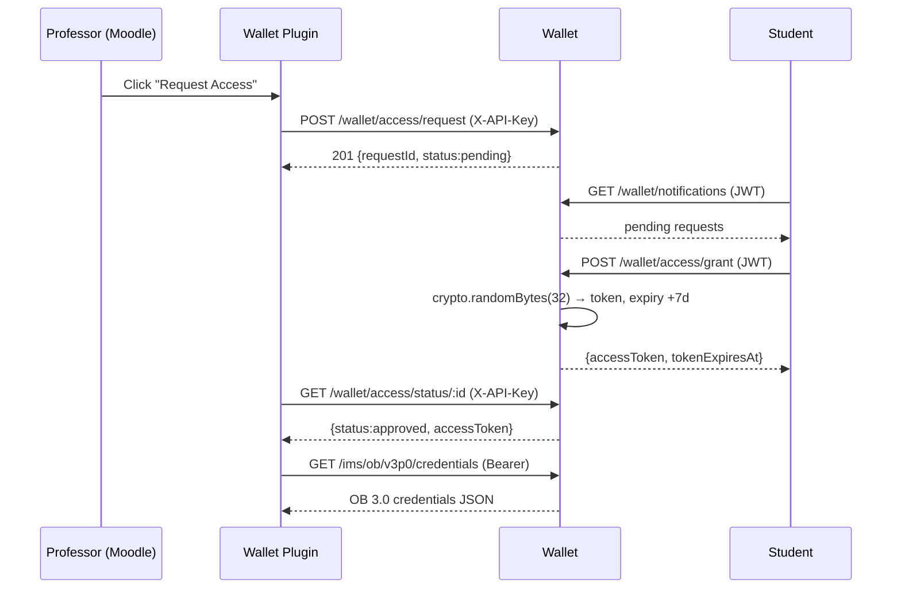

# Architecture Diagrams

Mermaid source for the diagrams used in `INTEGRATION.md`. Render with any Mermaid-compatible viewer (GitHub, VS Code Mermaid extension, mermaid.live).

## 1. System Overview

## 2. Auth Model

## 3. Flow A — Moodle Badge Import (Wallet pulls)

## 4. Flow B — Announcement & Upload (Moodle pushes)

## 5. Flow C — Consent-based Access (Flow 1, OAuth-like)

